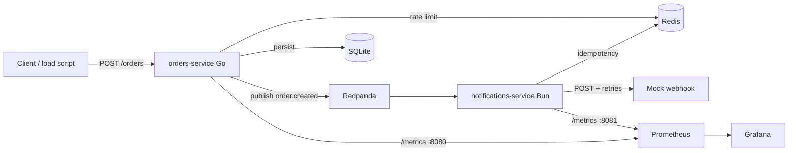

# Inventory System

Distributed orders + notifications with Kafka, Redis, and full observability.

Someone can clone this repo, run **one command**, open Grafana, and watch a live event pipeline under load.

```bash
make demo
open http://localhost:3000/d/ecommerce-observability   # admin / admin
make load
```

## What this demonstrates

| Concern | How it shows up here |
|---------|----------------------|
| Service boundaries | Go orders API vs Bun notifications consumer |
| Async messaging | `order.created` on Redpanda (Kafka protocol) |
| Reliability | Webhook retries with exponential backoff |
| Abuse protection | Redis fixed-window rate limit on `POST /orders` |
| Exactly-once delivery intent | Redis idempotency by `event_id` before webhooks |
| Observability | Prometheus metrics + Grafana dashboard (throughput, lag, latency, webhook health) |

Interview angle: a small but coherent distributed system — not a CRUD toy — with deliberate trade-offs (store-then-publish, fixed windows, commit-after-retries).

## Architecture



## Prerequisites

- Docker / Colima with Compose v2
- Go 1.22+
- [Bun](https://bun.sh)

## Quick start (one command)

```bash
make demo
```

That starts Redpanda, Redis, Prometheus, Grafana, the orders API, the mock webhook, and the notifications consumer.

| URL | Purpose |
|-----|---------|
| http://localhost:8080 | Orders API |
| http://localhost:8090/deliveries | Mock webhook inbox |
| http://localhost:8081/metrics | Notifications metrics |
| http://localhost:9090 | Prometheus |
| http://localhost:3000/d/ecommerce-observability | Grafana (`admin` / `admin`) |

### Load test (watch the dashboard)

```bash
make load                 # 100 orders, 10 parallel
make load-rate            # shared client → 429s
./scripts/load-orders.sh 200 20
```

### Stop

```bash
make stop-apps            # Go / Bun only
make down                 # apps + docker compose
```

### Useful Make targets

```bash
make help
make status
make smoke                # Kafka topic produce/consume
make up                   # infra only
```

## Manual create

```bash
curl -sS -X POST http://localhost:8080/orders \
  -H 'Content-Type: application/json' \
  -H 'X-Client-Id: demo' \
  -d '{"items":[{"sku":"WIDGET","quantity":2,"unit_price":1500}]}'
```

## Repo layout

```
orders-service/           # Go REST + Kafka producer + Redis rate limit + metrics
notifications-service/    # Bun consumer + webhooks + Redis idempotency + metrics
infra/                    # docker-compose, Prometheus, Grafana dashboard
scripts/                  # start-stack, load-orders, smoke-kafka
docs/                     # Day 1–7 write-ups
```

## Day-by-day docs

- [Day 1 — Local infra](docs/DAY-1.md)
- [Day 2 — Orders API](docs/DAY-2.md)
- [Day 3 — Notifications](docs/DAY-3.md)
- [Day 4 — Redis](docs/DAY-4.md)
- [Day 5 — Prometheus metrics](docs/DAY-5.md)
- [Day 6 — Grafana dashboard](docs/DAY-6.md)
- [Day 7 — Load test & polish](docs/DAY-7.md)

## License

See [LICENSE](LICENSE).
