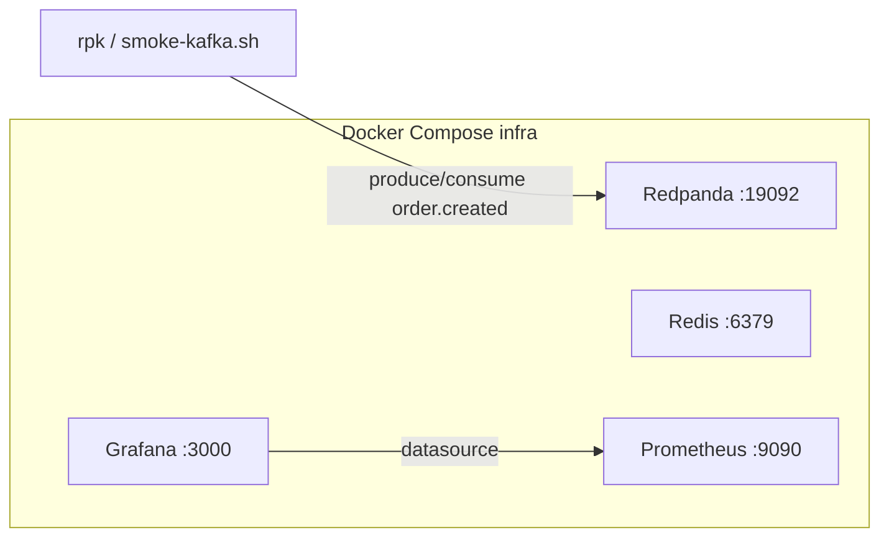

# Day 1 — Project skeleton + local infra

## Goal

Boot a local distributed stack with one command and prove Kafka produce/consume works before writing app code.

End state: `docker compose up` runs Redpanda, Redis, Prometheus, and Grafana; `./scripts/smoke-kafka.sh` creates `order.created` and round-trips a test message.

## Layout

```
/
├── orders-service/          # Go stub (filled in Day 2)
├── notifications-service/   # Bun stub (filled in Day 3)
├── infra/
│   ├── docker-compose.yml
│   ├── prometheus/prometheus.yml
│   └── grafana/provisioning/datasources/
├── scripts/smoke-kafka.sh
└── README.md
```

## Stack

| Service | Role | Host port |
|---------|------|-----------|
| Redpanda | Kafka-compatible broker | `19092` (Kafka), `9644` (admin) |
| Redis | Caching / rate limiting (used Day 4+) | `6379` |
| Prometheus | Metrics scrape (wired Day 5) | `9090` |
| Grafana | Dashboards (Day 6) | `3000` (admin/admin) |

Shared Docker network: `ecommerce-net`.

## Architecture



## Why Redpanda

Same Kafka protocol as Apache Kafka, far less setup for a solo portfolio project. Host clients use `localhost:19092`; containers use `redpanda:9092`.

## Smoke test

[`scripts/smoke-kafka.sh`](../scripts/smoke-kafka.sh):

1. Wait until Redpanda is healthy (`rpk cluster health`)
2. Create topic `order.created` (1 partition, 1 replica)
3. Produce a JSON test payload
4. Consume from the start and assert the payload appears

Manual equivalent:

```bash
cd infra
docker compose up -d
docker compose exec redpanda rpk topic create order.created --partitions 1 --replicas 1
echo '{"event_id":"smoke-001","order_id":"ord-001"}' \
  | docker compose exec -T redpanda rpk topic produce order.created
docker compose exec redpanda rpk topic consume order.created --offset start --num 1
```

## Verify

```bash
cd infra && docker compose up -d && docker compose ps
docker compose exec redis redis-cli ping          # PONG
# UIs: http://localhost:9090  http://localhost:3000 (admin/admin)
cd .. && ./scripts/smoke-kafka.sh
```

## Out of scope

App APIs, consumers, Redis logic, custom metrics panels — those start on Days 2–6.
