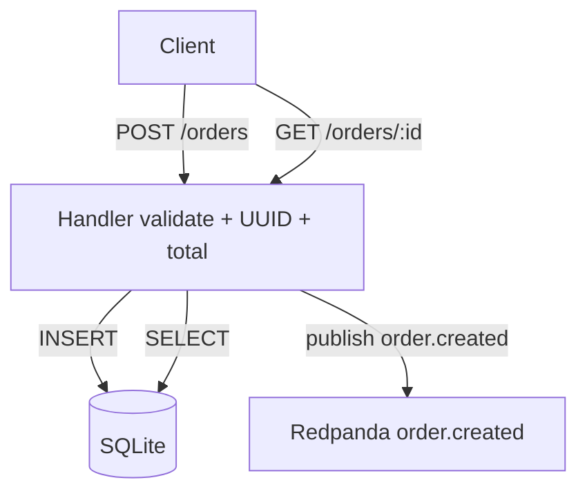

# Day 2 — Orders service (Go), core API

## Goal

Build a minimal orders REST API that persists to SQLite and publishes `order.created` to Kafka (Redpanda).

End state: `POST /orders` returns a stored order, and the same event is visible on the topic via `rpk`.

## Layout

```
orders-service/
├── cmd/server/main.go              # config, wiring, HTTP server
├── internal/
│   ├── order/
│   │   ├── model.go                # Order / Item schemas
│   │   ├── store.go                # SQLite persistence
│   │   └── handler.go              # HTTP handlers + validation
│   └── kafka/
│       └── publisher.go            # segmentio/kafka-go producer
├── data/orders.db                  # created at runtime (gitignored)
└── README.md
```

## Flow



## Order schema

| Field | Type | Notes |
|-------|------|--------|
| `id` | UUID string | Server-generated |
| `items` | array | `sku`, `quantity`, `unit_price` (cents) |
| `total` | int64 | Sum of `unit_price * quantity` (cents) |
| `status` | string | `"created"` on Day 2 |
| `timestamp` | RFC3339 | UTC create time |

### Create request

```json
{
  "items": [
    { "sku": "WIDGET", "quantity": 2, "unit_price": 1500 }
  ]
}
```

### Kafka event (`order.created`)

```json
{
  "event_id": "<uuid>",
  "event_type": "order.created",
  "order_id": "<order uuid>",
  "items": [...],
  "total": 3000,
  "status": "created",
  "timestamp": "..."
}
```

`event_id` is separate from `order_id` so Day 4 can dedupe webhook deliveries by event.

## HTTP API

| Method | Path | Behavior |
|--------|------|----------|
| `POST` | `/orders` | Validate → store → publish → `201` |
| `GET` | `/orders/{id}` | Load from SQLite → `200` / `404` |
| `GET` | `/healthz` | Liveness |

Validation: non-empty `items`; each item needs `sku`, `quantity > 0`, `unit_price >= 0`.

If Kafka publish fails after a successful insert, the API returns `500` (`order saved but failed to publish event`) — simple store-then-publish trade-off for Day 2.

## Pieces

| File | Role |
|------|------|
| `cmd/server/main.go` | Env config, SQLite + publisher wiring, graceful shutdown |
| `internal/order/model.go` | Types + `ComputeTotal` |
| `internal/order/store.go` | SQLite (`modernc.org/sqlite`, no CGO) |
| `internal/order/handler.go` | REST handlers |
| `internal/kafka/publisher.go` | `segmentio/kafka-go` writer; message key = order id |

## Config

| Variable | Default |
|----------|---------|
| `HTTP_ADDR` | `:8080` |
| `KAFKA_BROKERS` | `localhost:19092` |
| `KAFKA_TOPIC` | `order.created` |
| `SQLITE_PATH` | `data/orders.db` |

## Verify

Infra must already be up (`cd infra && docker compose up -d`).

```bash
cd orders-service
go run ./cmd/server

curl -sS -X POST http://localhost:8080/orders \
  -H 'Content-Type: application/json' \
  -d '{"items":[{"sku":"WIDGET","quantity":2,"unit_price":1500}]}'

curl -sS http://localhost:8080/orders/<id-from-response>

cd ../infra
docker compose exec redpanda rpk topic consume order.created --offset start -n 10 -f '%v\n'
```

### Where to observe

| What | Where |
|------|--------|
| Create success / errors | JSON logs in the `go run` terminal |
| Stored orders | `orders-service/data/orders.db` |
| Domain events | Topic `order.created` via `rpk` |

## Out of scope for Day 2

Notifications consumer, Redis, Prometheus instrumentation — Days 3–5.
