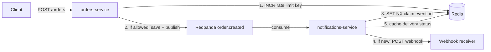
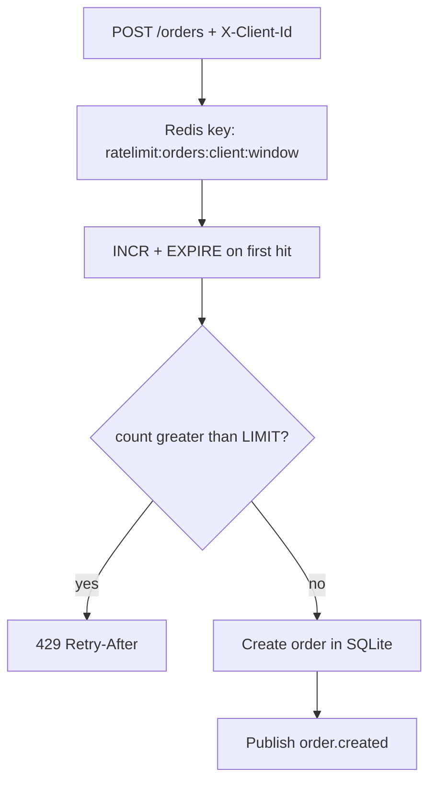
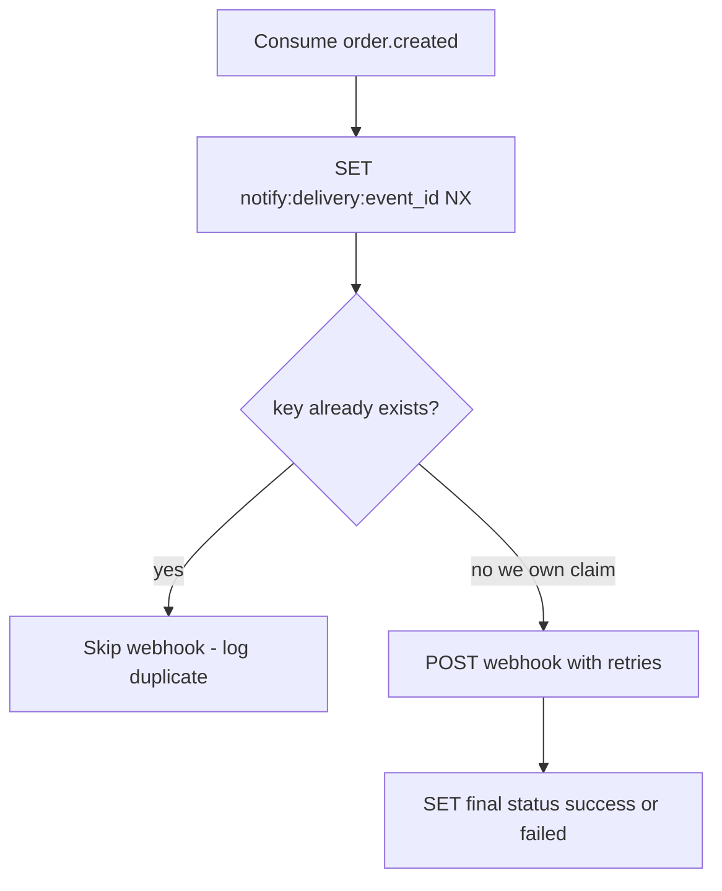

# Day 4 — Redis rate limiting + webhook idempotency

## Goal

Use Redis for two real jobs:

1. **Orders API** — fixed-window rate limit on `POST /orders`
2. **Notifications** — dedupe webhook delivery by `event_id` and cache delivery status

## How it fits together



Redis sits on both sides of the Kafka hop: it **throttles creates** before publish, and **dedupes deliveries** after consume.

### Rate limit path



### Idempotency path



## Orders: fixed-window rate limit

```
POST /orders
  → middleware reads X-Client-Id (or IP)
  → Redis INCR ratelimit:orders:{client}:{window}
  → if count > LIMIT → 429 + Retry-After
  → else handler continues
```

Defaults: **5 requests / 60 seconds** per client (`RATE_LIMIT`, `RATE_WINDOW_SEC`).

Response headers: `X-RateLimit-Limit`, `X-RateLimit-Remaining`.

Note: the window is aligned to the UTC clock (`unix / 60`). A burst that crosses a minute boundary can partially reset — expected for a simple fixed window.

## Notifications: idempotency

```
consume order.created
  → SET notify:delivery:{event_id} NX  (claim)
  → if key already exists → skip webhook (log duplicate)
  → else deliver webhook, then SET final status (success|failed)
```

TTL default: 7 days (`IDEMPOTENCY_TTL_SECONDS`).

## Verify rate limit

```bash
# restart orders-service after pull
for i in 1 2 3 4 5 6; do
  curl -sS -o /tmp/o$i.json -w "%{http_code}\n" -X POST http://localhost:8080/orders \
    -H 'Content-Type: application/json' \
    -H 'X-Client-Id: demo' \
    -d '{"items":[{"sku":"RL","quantity":1,"unit_price":100}]}'
done
# expect five 201s then a 429
```

## Verify webhook dedupe

```bash
# after an order creates a delivery, re-produce the same event JSON:
cd infra
echo '<same event payload>' | docker compose exec -T redpanda rpk topic produce order.created
# consumer logs "skip duplicate event"; GET :8090/deliveries count unchanged
```
