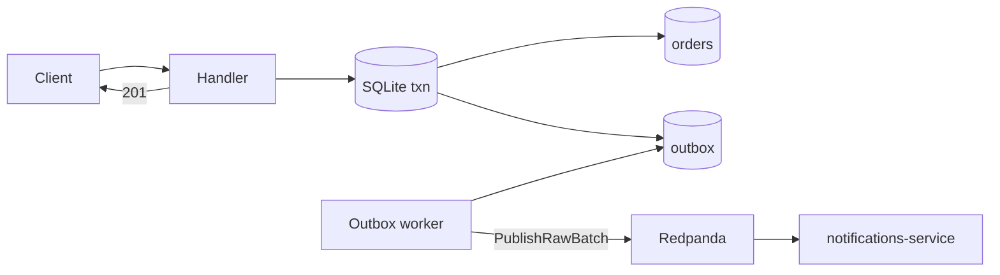

# Performance report

**Interactive version:** open [`performance-report.html`](./performance-report.html) in a browser.

```bash
open docs/performance-report.html
```

**Stack:** orders (Go) → outbox → Redpanda/Kafka → notifications (Bun) · Redis rate limit · Prometheus/Grafana  
**Sources:** Prometheus (`:9090`), service `/metrics`, k6 (`make stress`)  
**Fix shipped:** transactional outbox + batched async publisher (2026-08-07)

## Verdict

Moving Kafka off the HTTP path fixed the latency cliff.

| | Before (sync publish) | After (outbox) |
| --- | ---: | ---: |
| k6 requests (~70s, 25 VUs) | 1,371 | **27,574** |
| k6 fail rate | 0% | **0%** |
| k6 p50 | ~med / high ms | **1.2 ms** |
| k6 p95 | **~1.02 s** | **2.7 ms** |
| k6 max | — | 21.8 ms |
| Server avg POST latency | **992 ms** | **1.07 ms** |
| Prometheus p95 (load window) | **~2.4 s** | **~4.8 ms** |
| Create = publish = consume = webhook | 100% | **100%** (27,574) |
| Outbox pending after drain | n/a | **0** |
| Kafka publish errors | 0 | **0** |

Roughly **~380×** better p95 (1.02s → 2.7ms) and **~20×** more completed requests in the same stress profile.

## What changed

`POST /orders` used to wait on **SQLite + synchronous Kafka** (`Async: false` on the request path).

Now:

1. Validate request
2. One SQLite transaction: insert `orders` + `outbox` (full event JSON)
3. Return `201`
4. Background worker batches unpublished rows → Kafka → mark published



| Piece | Location |
| --- | --- |
| Order + outbox txn | `orders-service/internal/order/store.go` (`CreateWithOutbox`) |
| Async publisher | `orders-service/internal/order/outbox_worker.go` |
| Fast HTTP create | `orders-service/internal/order/handler.go` |
| Batch Kafka write | `orders-service/internal/kafka/publisher.go` (`PublishRawBatch`) |
| Metrics | `orders_published_total`, `orders_outbox_pending` |

## Baseline (before outbox) — earlier 2026-08-07 run

| Metric | Value |
| --- | --- |
| Orders created | 4,398 (lifetime process) |
| Peak create rate | 35.4/s |
| Avg POST `/orders` latency | 992 ms |
| p50 under load | ~1.7s |
| p95 under load (Prometheus) | ~2.4s |
| k6 (25 VUs, ~70s) | 1,371 req, 0% fail, p95 ~1.02s |
| Consumer lag (steady) | 0 |

### Findings (before)

1. Pipeline correctness held under load.
2. Consumer kept up; lag briefly peaked at 5.
3. Latency scaled poorly — sync Kafka + single-conn SQLite on the request path.
4. Rate limiting worked (15 rejects in that process lifetime).

## After outbox — measured 2026-08-07

Fresh SQLite, rebuilt binary via `make demo` / `scripts/start-stack.sh`, then `make stress`.

| Metric | Value |
| --- | --- |
| k6 requests | 27,574 |
| k6 fail rate | 0.00% |
| k6 p50 / p95 / max | 1.2 ms / 2.7 ms / 21.8 ms |
| Server avg POST latency | 1.072 ms (`sum/count`) |
| Prometheus p50 / p95 (2m rate window) | ~2.5 ms / ~4.8 ms |
| `orders_created_total` | 27,574 |
| `orders_published_total` | 27,574 |
| `orders_outbox_pending` (after drain) | 0 |
| `notifications_events_consumed_total` | 27,574 |
| `notifications_webhook_success_total` | 27,574 |
| `orders_kafka_publish_errors_total` | 0 |
| Consumer lag | 0 |

### Findings (after)

1. **HTTP no longer waits on Kafka** — p95 dropped from ~1s to a few milliseconds.
2. **Throughput jumped** — same VU profile completes far more iterations because each request returns quickly.
3. **Outbox drains cleanly** — with batched `WriteMessages`, pending returned to 0 immediately after the burst in this run.
4. **End-to-end parity remains** — created = published = consumed = webhook OK.
5. **Remaining limit** — SQLite still serializes writers (`MaxOpenConns(1)`). Fine for this demo; production would move to Postgres (or similar) for higher write QPS, not put Kafka back on the request path.

## Reproduce

```bash
make stop-apps
make demo
make stress
```

Watch:

- Grafana: http://localhost:3000/d/ecommerce-observability
- `rate(orders_created_total[1m])` vs `rate(orders_published_total[1m])`
- `orders_outbox_pending`
- POST `/orders` p50 / p95 panel
